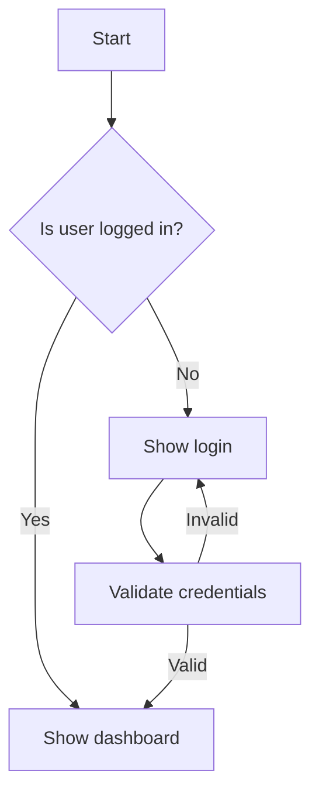
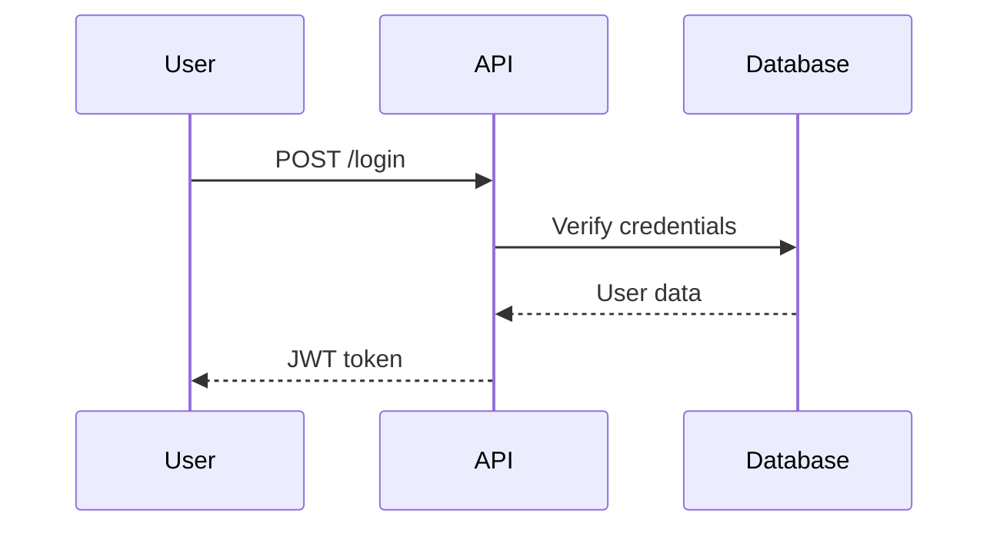
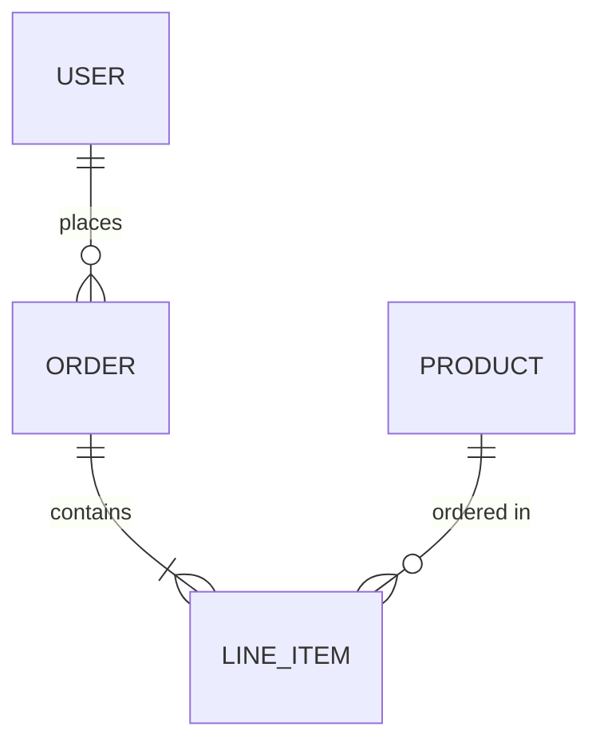

# Documentation

Create clear, maintainable technical documentation.

## Documentation Types

```
┌─────────────────────────────────────────────────────────────┐
│                  DOCUMENTATION LANDSCAPE                     │
├─────────────────────────────────────────────────────────────┤
│                                                             │
│  README              API DOCS            ARCHITECTURE       │
│  ┌─────────────┐    ┌─────────────┐    ┌─────────────┐     │
│  │ First       │    │ Endpoint    │    │ ADRs        │     │
│  │ impression  │    │ reference   │    │ System      │     │
│  │ Quick start │    │ Examples    │    │ design      │     │
│  └─────────────┘    └─────────────┘    └─────────────┘     │
│                                                             │
│  USER GUIDES         CODE DOCS          DIAGRAMS           │
│  ┌─────────────┐    ┌─────────────┐    ┌─────────────┐     │
│  │ How-to      │    │ JSDoc       │    │ Mermaid     │     │
│  │ Tutorials   │    │ Inline      │    │ Architecture│     │
│  │ Workflows   │    │ comments    │    │ Flows       │     │
│  └─────────────┘    └─────────────┘    └─────────────┘     │
│                                                             │
└─────────────────────────────────────────────────────────────┘
```

## Selection Guide

| Type | When to Use | Audience |
|------|-------------|----------|
| README | Project entry point | All users |
| API Docs | Endpoint reference | Developers |
| ADR | Major decisions | Team/future devs |
| User Guide | Task completion | End users |
| Code Docs | Implementation | Contributors |

## Core Principles

### 1. Documentation as Code
Docs live with code, version with code, review with code.

```
✅ Docs in repo alongside source
✅ Markdown for portability
✅ Generated docs from source (OpenAPI, JSDoc)
✅ CI checks for doc freshness
```

### 2. Audience-First Writing
Write for who's reading, not what you know.

```
✅ README: "I just found this repo"
✅ API Docs: "How do I call this endpoint?"
✅ ADR: "Why was this decision made?"
✅ Guide: "How do I accomplish X?"
```

### 3. Maintainability Over Completeness
Less accurate docs are worse than no docs.

```
✅ Link to source of truth
✅ Automate what changes often
✅ Date and version sensitive content
❌ Duplicate information across docs
```

## README Essentials

A good README answers in order:

1. **What** — What is this? (1-2 sentences)
2. **Why** — Why should I care? (value proposition)
3. **How** — How do I use it? (quick start)
4. **More** — Where do I learn more? (links)

### Minimal README Structure

```markdown
# Project Name

One-line description of what this does.

## Quick Start

\`\`\`bash
npm install project-name
\`\`\`

\`\`\`javascript
import { thing } from 'project-name';
thing.doSomething();
\`\`\`

## Documentation

- [Full API Reference](./docs/api.md)
- [Contributing Guide](./CONTRIBUTING.md)

## License

MIT
```

### README Anti-Patterns

```
❌ No description at all
❌ Wall of badges before content
❌ Jumping to API docs before quick start
❌ Outdated installation instructions
❌ Screenshots that don't match current UI
```

## API Documentation Pattern

### Structure per Endpoint

```markdown
## Create User

Creates a new user account.

\`\`\`http
POST /api/v1/users
\`\`\`

### Request

| Parameter | Type | Required | Description |
|-----------|------|----------|-------------|
| email | string | Yes | User email address |
| name | string | Yes | Display name |
| role | string | No | Default: "user" |

\`\`\`json
{
  "email": "user@example.com",
  "name": "Jane Doe"
}
\`\`\`

### Response

**201 Created**
\`\`\`json
{
  "id": "usr_123",
  "email": "user@example.com",
  "name": "Jane Doe",
  "createdAt": "2024-01-15T10:30:00Z"
}
\`\`\`

### Errors

| Code | Description |
|------|-------------|
| 400 | Invalid email format |
| 409 | Email already exists |
```

### OpenAPI Integration

When OpenAPI spec exists, generate docs from it:

```bash
# Generate markdown from OpenAPI
npx @redocly/cli build-docs openapi.yaml -o docs/api.html

# Or use inline references
See [OpenAPI spec](./openapi.yaml) for complete API reference.
```

## Architecture Decision Records (ADRs)

### When to Write an ADR

Write an ADR when:
- Choosing between significant alternatives
- Making decisions hard to reverse
- Establishing patterns the team should follow
- Future developers will ask "why?"

### ADR Format

```markdown
# ADR-001: Use PostgreSQL for Primary Database

## Status
Accepted | Proposed | Deprecated | Superseded by ADR-XXX

## Context
What is the issue? What forces are at play?

## Decision
What is the change being proposed/adopted?

## Consequences
What are the positive/negative outcomes?
```

### ADR Numbering

```
docs/adr/
├── 0001-use-postgresql.md
├── 0002-adopt-typescript.md
├── 0003-api-versioning-strategy.md
└── README.md (index of decisions)
```

## Diagrams with Mermaid

### Flowchart



### Sequence Diagram



### Entity Relationship



## Documentation Workflow

### 1. New Feature Documentation

```
Feature PR should include:
├── README updates (if user-facing)
├── API docs (if new endpoints)
├── ADR (if significant decision)
└── Code comments (if complex logic)
```

### 2. Keeping Docs in Sync

```yaml
# In PR template or CI
Documentation checklist:
- [ ] README updated if behavior changed
- [ ] API docs match implementation
- [ ] ADR written for architectural changes
- [ ] Examples tested and working
```

### 3. Documentation Review

Check for:
- Accuracy (does it match the code?)
- Completeness (all parameters documented?)
- Clarity (would a new dev understand?)
- Examples (do they work?)

## Code Documentation

### JSDoc Pattern

```javascript
/**
 * Creates a new user in the system.
 * 
 * @param {Object} userData - User creation data
 * @param {string} userData.email - Unique email address
 * @param {string} userData.name - Display name
 * @param {string} [userData.role='user'] - User role
 * @returns {Promise<User>} Created user object
 * @throws {ValidationError} If email format invalid
 * @throws {ConflictError} If email already exists
 * 
 * @example
 * const user = await createUser({
 *   email: 'jane@example.com',
 *   name: 'Jane Doe'
 * });
 */
async function createUser(userData) { ... }
```

### When to Comment

```javascript
// ✅ Explain WHY, not WHAT
// Rate limit is 100/min per Stripe docs, with buffer for retries
const RATE_LIMIT = 80;

// ✅ Explain non-obvious behavior
// Sort descending because UI shows newest first
items.sort((a, b) => b.date - a.date);

// ❌ Don't state the obvious
// Increment counter by 1
counter++;
```

## Checklist

### README
- [ ] Clear one-line description
- [ ] Quick start works (tested)
- [ ] Installation instructions current
- [ ] Links to deeper docs

### API Docs
- [ ] All endpoints documented
- [ ] Request/response examples
- [ ] Error codes explained
- [ ] Authentication documented

### ADRs
- [ ] Decision rationale clear
- [ ] Alternatives considered
- [ ] Consequences listed
- [ ] Linked from index

### General
- [ ] No duplicate information
- [ ] Examples tested
- [ ] Links working
- [ ] Dates/versions noted

---

**References:**
- [references/readme-guide.md](references/readme-guide.md) — README templates, section patterns, badges
- [references/api-docs.md](references/api-docs.md) — API documentation patterns, OpenAPI integration
- [references/adr-guide.md](references/adr-guide.md) — Architecture Decision Record format and workflow
- [references/diagrams.md](references/diagrams.md) — Mermaid diagram patterns for common scenarios

**Templates:**
- [assets/README-template.md](assets/README-template.md) — Starter README template
- [assets/ADR-template.md](assets/ADR-template.md) — Architecture Decision Record template
