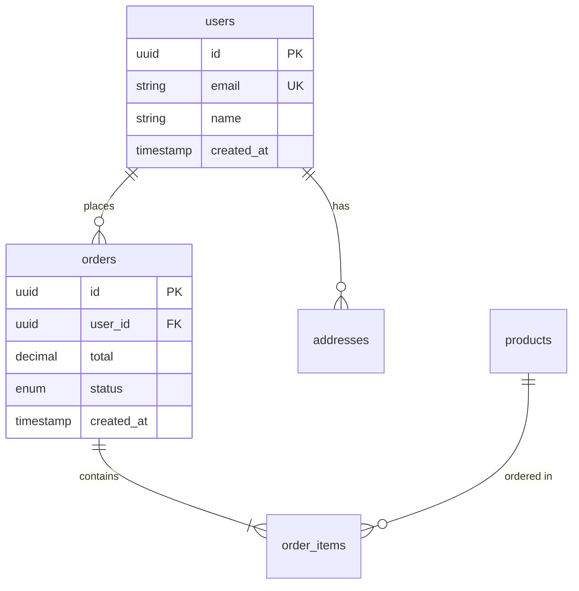

# Database Design

Design efficient, maintainable database schemas with safe migration strategies.

## Design Process

```
┌─────────────────────────────────────────────────────────────────┐
│                    DATABASE DESIGN PROCESS                       │
├─────────────────────────────────────────────────────────────────┤
│                                                                 │
│  1. REQUIREMENTS      2. MODELING         3. SCHEMA             │
│  ┌─────────────┐     ┌─────────────┐     ┌─────────────┐       │
│  │ Entities    │  →  │ ER diagram  │  →  │ Tables &    │       │
│  │ Attributes  │     │ Relations   │     │ Columns     │       │
│  │ Constraints │     │ Cardinality │     │ Constraints │       │
│  └─────────────┘     └─────────────┘     └─────────────┘       │
│                                                                 │
│  4. INDEXES          5. MIGRATION        6. REVIEW              │
│  ┌─────────────┐     ┌─────────────┐     ┌─────────────┐       │
│  │ Query       │  →  │ Safe changes│  →  │ Performance │       │
│  │ patterns    │     │ Rollback    │     │ Consistency │       │
│  │ Performance │     │ Zero-down   │     │ Integrity   │       │
│  └─────────────┘     └─────────────┘     └─────────────┘       │
│                                                                 │
└─────────────────────────────────────────────────────────────────┘
```

## Core Principles

### 1. Data Integrity First
Enforce constraints at the database level, not just application.

```sql
-- ✅ Database enforces integrity
CREATE TABLE orders (
  id UUID PRIMARY KEY DEFAULT gen_random_uuid(),
  user_id UUID NOT NULL REFERENCES users(id),
  total DECIMAL(10,2) NOT NULL CHECK (total >= 0),
  status VARCHAR(20) NOT NULL DEFAULT 'pending'
);

-- ❌ Relying only on application validation
CREATE TABLE orders (
  id INTEGER,
  user_id INTEGER,  -- no FK
  total TEXT        -- wrong type, no constraint
);
```

### 2. Normalize by Default, Denormalize with Purpose
Start with 3NF. Denormalize only when you have measured performance needs.

```
✅ Normalize: Eliminate redundancy, maintain consistency
✅ Denormalize: Reduce joins for read-heavy queries (with justification)
❌ Premature optimization without query patterns
```

### 3. Explicit Over Implicit
Clear naming, explicit constraints, documented decisions.

```sql
-- ✅ Explicit
user_id UUID NOT NULL REFERENCES users(id) ON DELETE CASCADE
created_at TIMESTAMPTZ NOT NULL DEFAULT NOW()

-- ❌ Implicit
user INTEGER  -- What does this reference?
created TEXT  -- When? Timezone?
```

### 4. Plan for Evolution
Schema will change. Design for safe migrations.

```
✅ Additive changes preferred (add columns, tables)
✅ Nullable new columns (can deploy before backfill)
✅ Soft deletes for recoverable data
❌ Breaking changes without migration plan
```

## Quick Decisions

### Primary Key Strategy

| Strategy | Use When | Pros | Cons |
|----------|----------|------|------|
| UUID v4 | Distributed systems, security-sensitive | No collisions, unpredictable | 128-bit, random = bad index | 
| UUID v7 | Modern default choice | Sortable, no collisions | Larger than integer |
| ULID | Need K-sortable + readable | URL-safe, time-ordered | Less common |
| Auto-increment | Simple apps, legacy compat | Small, sequential | Enumerable, single-point |
| Composite | Junction tables | Natural fit for M:N | Complex queries |

**Recommendation:** UUID v7 or ULID for new projects. Auto-increment for simple apps.

### Relationship Patterns

```
One-to-One:   user ←→ profile       → FK + UNIQUE on child
One-to-Many:  user ←→ orders        → FK on "many" side
Many-to-Many: users ←→ roles        → Junction table
Self-ref:     employee ←→ manager   → FK to same table
Polymorphic:  comments on any entity → See references/schema-patterns.md
```

### When to Denormalize

| Signal | Action |
|--------|--------|
| N+1 queries in hot path | Consider embedding |
| Join across 4+ tables frequently | Materialized view or redundant column |
| Counting relationships is slow | Store counter cache |
| Full-text search on joined data | Denormalize to search index |

**Rule:** Measure first. Denormalize with documentation.

### Soft Delete vs Hard Delete

| Use Soft Delete | Use Hard Delete |
|-----------------|-----------------|
| Audit requirements | GDPR "right to erasure" |
| User-recoverable data | Session/temporary data |
| Billing/financial records | PII after retention period |
| Referenced by other tables | Truly ephemeral data |

```sql
-- Soft delete pattern
deleted_at TIMESTAMPTZ DEFAULT NULL
-- Query non-deleted: WHERE deleted_at IS NULL
-- Create partial index for performance
CREATE INDEX idx_users_active ON users(email) WHERE deleted_at IS NULL;
```

## Standard Schema Patterns

### Timestamps

Always include, always use timezone:

```sql
created_at TIMESTAMPTZ NOT NULL DEFAULT NOW(),
updated_at TIMESTAMPTZ NOT NULL DEFAULT NOW()
-- Add trigger or ORM hook for updated_at
```

### Audit Columns

```sql
created_by UUID REFERENCES users(id),
updated_by UUID REFERENCES users(id),
created_at TIMESTAMPTZ NOT NULL DEFAULT NOW(),
updated_at TIMESTAMPTZ NOT NULL DEFAULT NOW()
```

### Soft Delete

```sql
deleted_at TIMESTAMPTZ DEFAULT NULL,
deleted_by UUID REFERENCES users(id)
```

### Versioning

```sql
version INTEGER NOT NULL DEFAULT 1
-- Increment on update, use for optimistic locking
```

## Index Design Checklist

```
□ Primary key (automatic)
□ Foreign keys (add manually in most DBs)
□ Unique constraints
□ Columns in WHERE clauses (high selectivity)
□ Columns in ORDER BY
□ Columns in JOIN conditions
□ Composite indexes for multi-column queries

⚠️ Avoid:
□ Indexing low-cardinality columns alone (status, boolean)
□ Over-indexing (slows writes)
□ Indexes that duplicate existing coverage
```

### Index Types Quick Reference

| Type | Use Case | Example |
|------|----------|---------|
| B-tree | Default, range queries | Most columns |
| Hash | Equality only | Lookup tables |
| GIN | Arrays, JSONB, full-text | Tags, search |
| GiST | Geometric, range types | PostGIS, tsrange |
| BRIN | Very large, naturally ordered | Time-series |

## Migration Safety Checklist

Before any production migration:

```
□ Migration is reversible (has rollback plan)
□ Tested on copy of production data
□ Estimated lock time calculated
□ Deployment can proceed if migration fails
□ New code works with old AND new schema
□ Backfill strategy for new columns
```

### Safe Migration Patterns

| Change | Safe Approach |
|--------|---------------|
| Add column | Add as nullable, deploy code, backfill, add NOT NULL |
| Remove column | Stop using in code, deploy, then remove column |
| Rename column | Add new, copy data, update code, remove old |
| Add index | CREATE INDEX CONCURRENTLY (PostgreSQL) |
| Add constraint | Add as NOT VALID, then VALIDATE separately |

### Dangerous Operations

```sql
-- ⚠️ Locks table (avoid on large tables)
ALTER TABLE users ADD COLUMN name VARCHAR(255) NOT NULL DEFAULT '';
ALTER TABLE users ADD CONSTRAINT ... (without NOT VALID);
CREATE INDEX idx_users_email ON users(email);  -- non-concurrent

-- ✅ Safe alternatives
ALTER TABLE users ADD COLUMN name VARCHAR(255);  -- nullable first
ALTER TABLE users ADD CONSTRAINT ... NOT VALID;
ALTER TABLE users VALIDATE CONSTRAINT ...;  -- separate transaction
CREATE INDEX CONCURRENTLY idx_users_email ON users(email);
```

## Anti-Patterns

### ❌ God Tables
```sql
-- Everything in one table
CREATE TABLE data (
  id SERIAL,
  type VARCHAR(50),
  json_blob JSONB
);
-- No type safety, impossible to query efficiently
```

### ❌ EAV (Entity-Attribute-Value)
```sql
-- Attributes as rows
CREATE TABLE attributes (
  entity_id INT,
  attribute_name VARCHAR(100),
  attribute_value TEXT
);
-- Impossible to enforce types, terrible performance
```

### ❌ Implicit Relationships
```sql
-- Magic strings instead of FKs
CREATE TABLE orders (
  user TEXT,  -- Is this user_id? username? email?
  product TEXT
);
```

### ❌ Over-denormalization
```sql
-- Copying everything everywhere
CREATE TABLE orders (
  user_name VARCHAR(255),     -- What if name changes?
  user_email VARCHAR(255),    -- Stale data guaranteed
  user_address TEXT,
  user_phone VARCHAR(50)
);
```

### ❌ Missing Constraints
```sql
-- Database allows invalid data
CREATE TABLE products (
  price DECIMAL,  -- Can be NULL, negative, anything
  quantity INT    -- Negative inventory?
);
```

## ORM Integration

### Prisma Conventions

```prisma
model User {
  id        String   @id @default(uuid())
  email     String   @unique
  orders    Order[]
  createdAt DateTime @default(now()) @map("created_at")
  updatedAt DateTime @updatedAt @map("updated_at")
  
  @@map("users")
}

model Order {
  id        String   @id @default(uuid())
  userId    String   @map("user_id")
  user      User     @relation(fields: [userId], references: [id])
  total     Decimal
  status    OrderStatus @default(PENDING)
  
  @@map("orders")
  @@index([userId])
}
```

### Drizzle Conventions

```typescript
export const users = pgTable('users', {
  id: uuid('id').primaryKey().defaultRandom(),
  email: varchar('email', { length: 255 }).notNull().unique(),
  createdAt: timestamp('created_at').notNull().defaultNow(),
  updatedAt: timestamp('updated_at').notNull().defaultNow(),
});

export const orders = pgTable('orders', {
  id: uuid('id').primaryKey().defaultRandom(),
  userId: uuid('user_id').notNull().references(() => users.id),
  total: decimal('total', { precision: 10, scale: 2 }).notNull(),
  status: varchar('status', { length: 20 }).notNull().default('pending'),
}, (table) => ({
  userIdIdx: index('orders_user_id_idx').on(table.userId),
}));
```

## Design Deliverables

When designing a new schema, produce:

1. **Entity list** - All entities with key attributes
2. **ER diagram** - Relationships and cardinality (Mermaid or similar)
3. **Schema DDL** - CREATE TABLE statements
4. **Index plan** - Expected queries and supporting indexes
5. **Migration plan** - If modifying existing schema

### Example ER Diagram (Mermaid)



---

**References:**
- [references/schema-patterns.md](references/schema-patterns.md) — Common schema patterns (users, multi-tenant, polymorphic, etc.)
- [references/migration-strategies.md](references/migration-strategies.md) — Safe migration techniques, rollback procedures, zero-downtime patterns
- [references/index-design.md](references/index-design.md) — When and how to add indexes, query analysis
- [references/postgresql.md](references/postgresql.md) — PostgreSQL-specific features, extensions, optimization
- [references/prisma-patterns.md](references/prisma-patterns.md) — Prisma schema design, migrations, best practices
- [references/query-optimization.md](references/query-optimization.md) — Identifying and fixing slow queries, EXPLAIN analysis
