# Diagram Patterns

Mermaid diagram patterns for technical documentation.

## Flowcharts

### Basic Flowchart

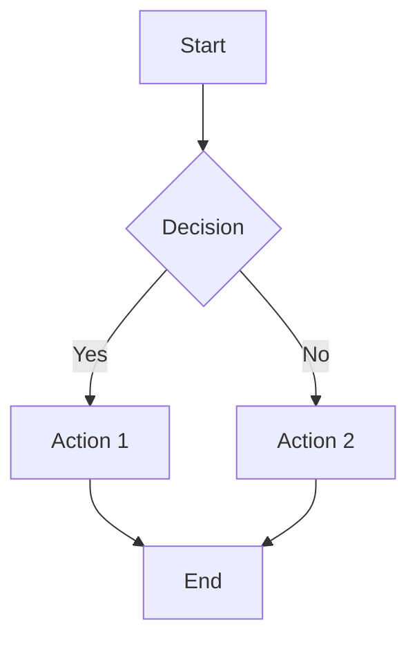
```mermaid
flowchart TD
    A[Start] --> B{Decision}
    B -->|Yes| C[Action 1]
    B -->|No| D[Action 2]
    C --> E[End]
    D --> E
```

### Node Shapes

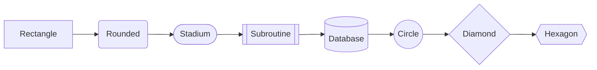
```mermaid
flowchart LR
    A[Rectangle] --> B(Rounded)
    B --> C([Stadium])
    C --> D[[Subroutine]]
    D --> E[(Database)]
    E --> F((Circle))
    F --> G{Diamond}
    G --> H{{Hexagon}}
```

### Subgraphs

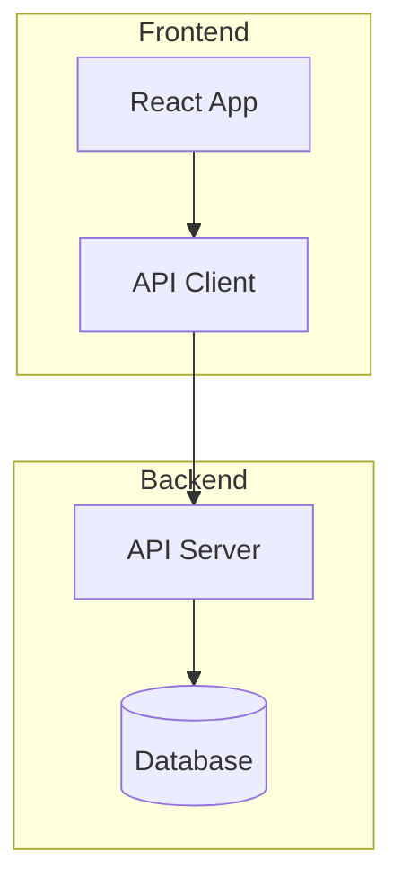
```mermaid
flowchart TB
    subgraph Frontend
        A[React App] --> B[API Client]
    end
    subgraph Backend
        C[API Server] --> D[(Database)]
    end
    B --> C
```

### User Flow Example

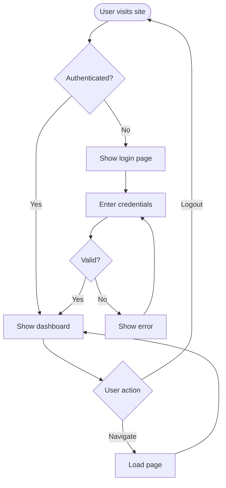
```mermaid
flowchart TD
    Start([User visits site]) --> Auth{Authenticated?}
    Auth -->|No| Login[Show login page]
    Auth -->|Yes| Dashboard[Show dashboard]
    
    Login --> Creds[Enter credentials]
    Creds --> Valid{Valid?}
    Valid -->|No| Error[Show error]
    Valid -->|Yes| Dashboard
    Error --> Creds
    
    Dashboard --> Action{User action}
    Action -->|Logout| Start
    Action -->|Navigate| Page[Load page]
    Page --> Dashboard
```

## Sequence Diagrams

### Basic Sequence

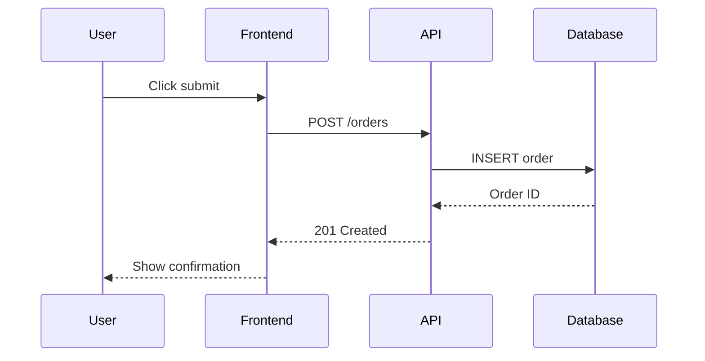
```mermaid
sequenceDiagram
    participant U as User
    participant F as Frontend
    participant A as API
    participant D as Database
    
    U->>F: Click submit
    F->>A: POST /orders
    A->>D: INSERT order
    D-->>A: Order ID
    A-->>F: 201 Created
    F-->>U: Show confirmation
```

### With Activation Boxes

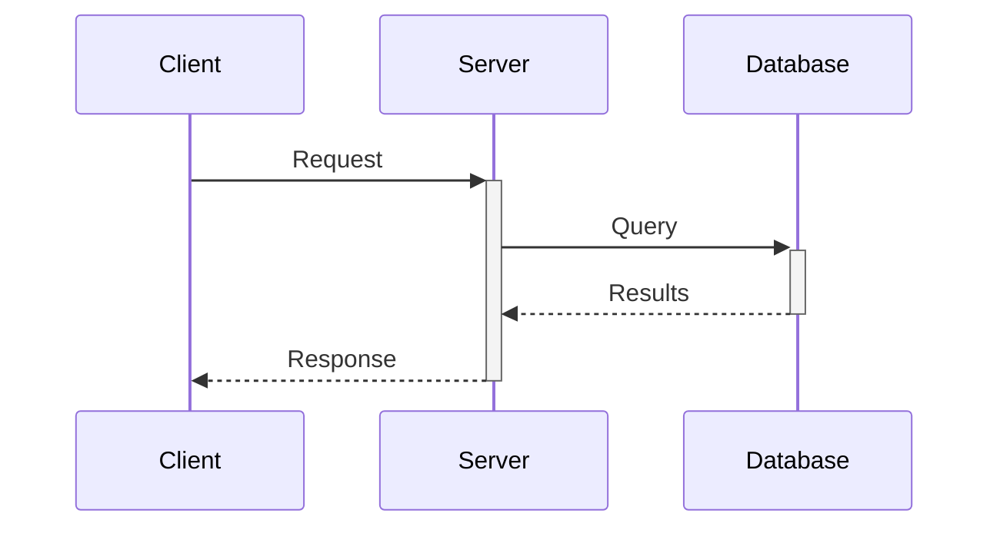
```mermaid
sequenceDiagram
    participant C as Client
    participant S as Server
    participant DB as Database
    
    C->>+S: Request
    S->>+DB: Query
    DB-->>-S: Results
    S-->>-C: Response
```

### Async Operations

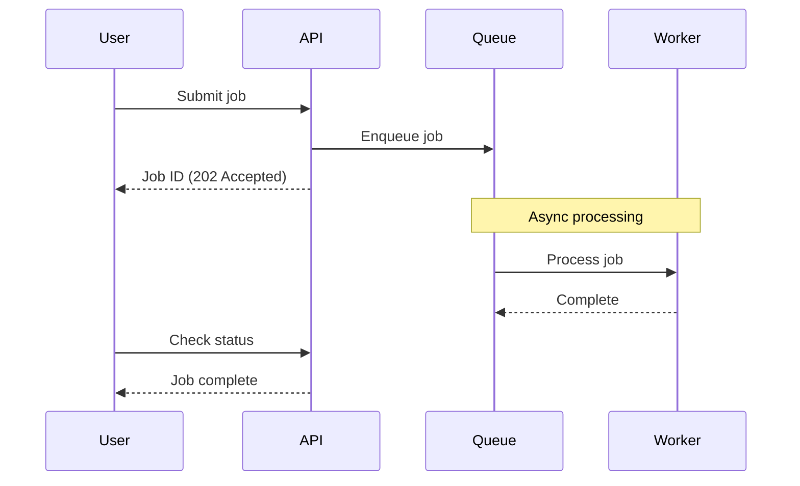
```mermaid
sequenceDiagram
    participant U as User
    participant A as API
    participant Q as Queue
    participant W as Worker
    
    U->>A: Submit job
    A->>Q: Enqueue job
    A-->>U: Job ID (202 Accepted)
    
    Note over Q,W: Async processing
    
    Q->>W: Process job
    W-->>Q: Complete
    
    U->>A: Check status
    A-->>U: Job complete
```

### Authentication Flow

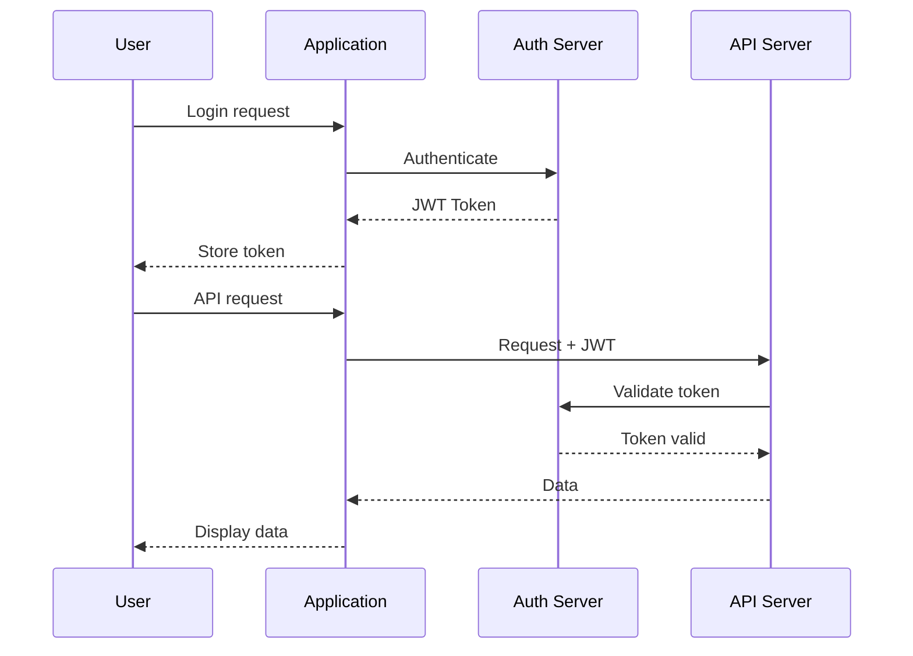
```mermaid
sequenceDiagram
    participant U as User
    participant App as Application
    participant Auth as Auth Server
    participant API as API Server
    
    U->>App: Login request
    App->>Auth: Authenticate
    Auth-->>App: JWT Token
    App-->>U: Store token
    
    U->>App: API request
    App->>API: Request + JWT
    API->>Auth: Validate token
    Auth-->>API: Token valid
    API-->>App: Data
    App-->>U: Display data
```

## Entity Relationship Diagrams

### Basic ERD

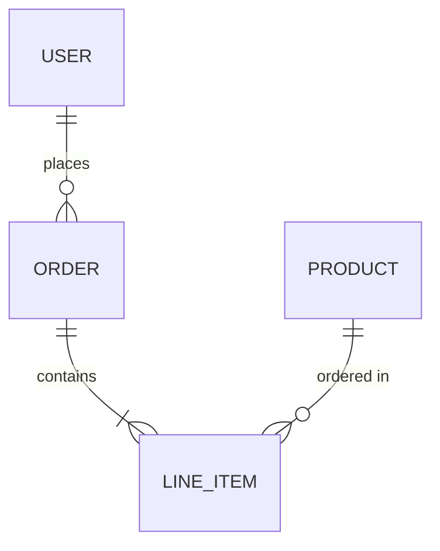
```mermaid
erDiagram
    USER ||--o{ ORDER : places
    ORDER ||--|{ LINE_ITEM : contains
    PRODUCT ||--o{ LINE_ITEM : "ordered in"
```

### With Attributes

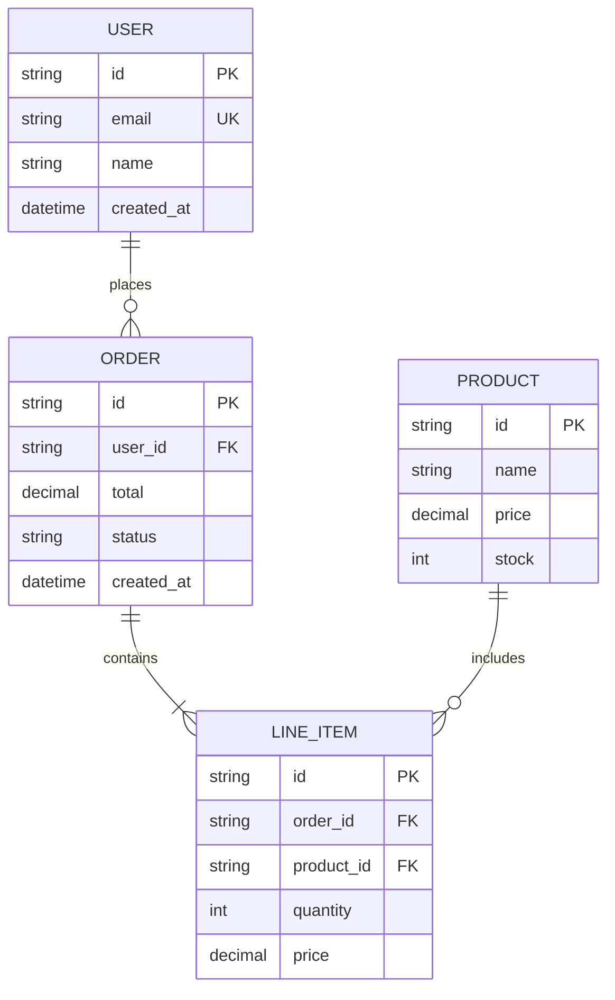
```mermaid
erDiagram
    USER {
        string id PK
        string email UK
        string name
        datetime created_at
    }
    ORDER {
        string id PK
        string user_id FK
        decimal total
        string status
        datetime created_at
    }
    LINE_ITEM {
        string id PK
        string order_id FK
        string product_id FK
        int quantity
        decimal price
    }
    PRODUCT {
        string id PK
        string name
        decimal price
        int stock
    }
    
    USER ||--o{ ORDER : places
    ORDER ||--|{ LINE_ITEM : contains
    PRODUCT ||--o{ LINE_ITEM : includes
```

### Relationship Types

```
||--|| : One to one
||--o{ : One to many
}o--o{ : Many to many
||..|| : One to one (non-identifying)
```

## State Diagrams

### Basic State Machine

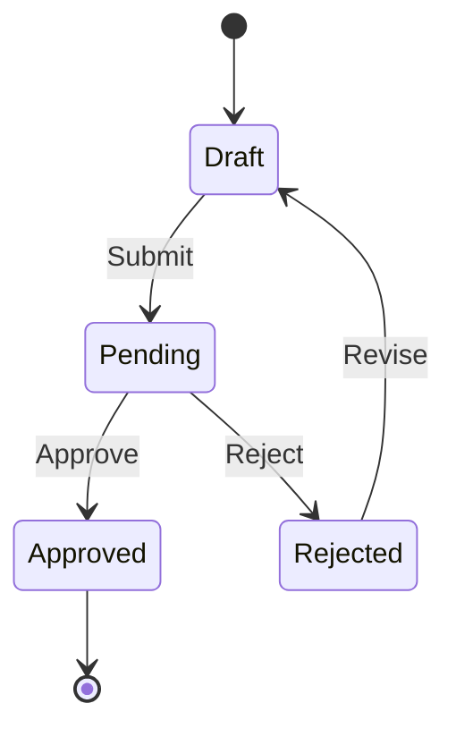
```mermaid
stateDiagram-v2
    [*] --> Draft
    Draft --> Pending: Submit
    Pending --> Approved: Approve
    Pending --> Rejected: Reject
    Rejected --> Draft: Revise
    Approved --> [*]
```

### With Nested States

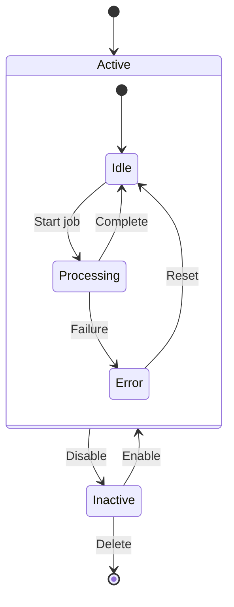
```mermaid
stateDiagram-v2
    [*] --> Active
    
    state Active {
        [*] --> Idle
        Idle --> Processing: Start job
        Processing --> Idle: Complete
        Processing --> Error: Failure
        Error --> Idle: Reset
    }
    
    Active --> Inactive: Disable
    Inactive --> Active: Enable
    Inactive --> [*]: Delete
```

### Order State Example

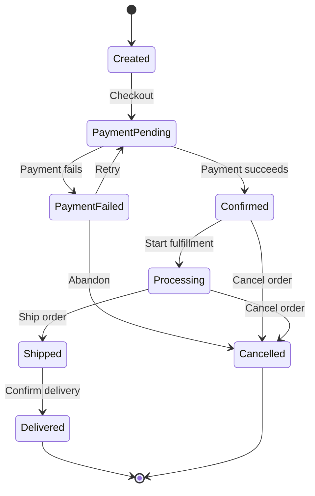
```mermaid
stateDiagram-v2
    [*] --> Created
    Created --> PaymentPending: Checkout
    
    PaymentPending --> PaymentFailed: Payment fails
    PaymentPending --> Confirmed: Payment succeeds
    PaymentFailed --> PaymentPending: Retry
    PaymentFailed --> Cancelled: Abandon
    
    Confirmed --> Processing: Start fulfillment
    Processing --> Shipped: Ship order
    Shipped --> Delivered: Confirm delivery
    
    Delivered --> [*]
    Cancelled --> [*]
    
    Confirmed --> Cancelled: Cancel order
    Processing --> Cancelled: Cancel order
```

## Architecture Diagrams

### C4 Context Diagram Style

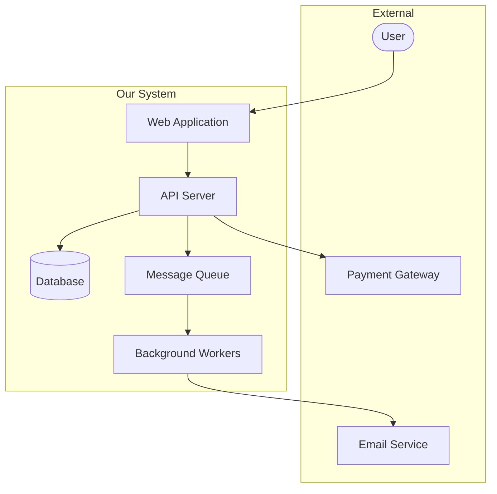
```mermaid
flowchart TB
    subgraph External
        User([User])
        Email[Email Service]
        Payment[Payment Gateway]
    end
    
    subgraph System["Our System"]
        Web[Web Application]
        API[API Server]
        DB[(Database)]
        Queue[Message Queue]
        Worker[Background Workers]
    end
    
    User --> Web
    Web --> API
    API --> DB
    API --> Queue
    Queue --> Worker
    Worker --> Email
    API --> Payment
```

### Microservices Architecture

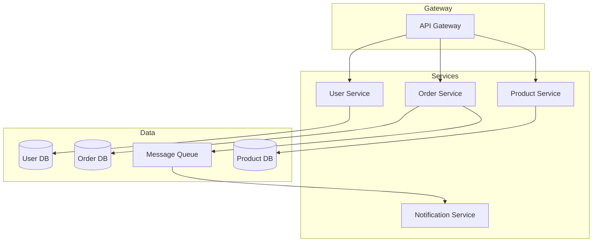
```mermaid
flowchart TB
    subgraph Gateway
        AG[API Gateway]
    end
    
    subgraph Services
        US[User Service]
        OS[Order Service]
        PS[Product Service]
        NS[Notification Service]
    end
    
    subgraph Data
        UD[(User DB)]
        OD[(Order DB)]
        PD[(Product DB)]
        MQ[Message Queue]
    end
    
    AG --> US
    AG --> OS
    AG --> PS
    
    US --> UD
    OS --> OD
    PS --> PD
    
    OS --> MQ
    MQ --> NS
```

### Deployment Diagram

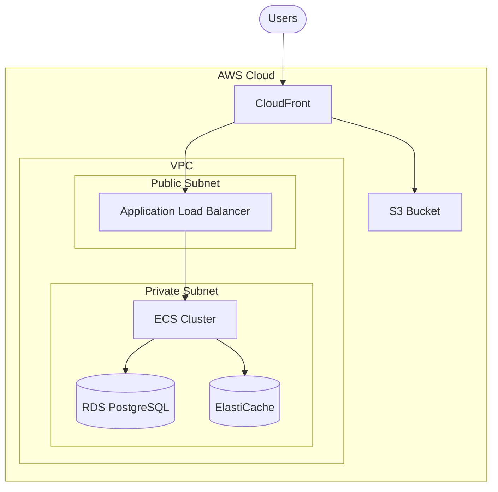
```mermaid
flowchart TB
    subgraph Cloud["AWS Cloud"]
        subgraph VPC
            subgraph Public["Public Subnet"]
                ALB[Application Load Balancer]
            end
            subgraph Private["Private Subnet"]
                ECS[ECS Cluster]
                RDS[(RDS PostgreSQL)]
                Redis[(ElastiCache)]
            end
        end
        S3[S3 Bucket]
        CF[CloudFront]
    end
    
    User([Users]) --> CF
    CF --> S3
    CF --> ALB
    ALB --> ECS
    ECS --> RDS
    ECS --> Redis
```

## Gantt Charts

### Project Timeline

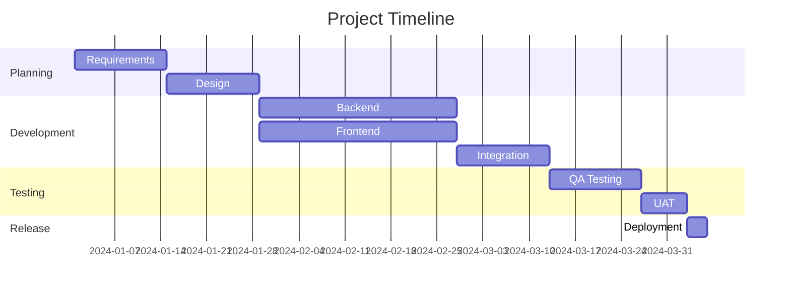
```mermaid
gantt
    title Project Timeline
    dateFormat YYYY-MM-DD
    
    section Planning
    Requirements    :a1, 2024-01-01, 14d
    Design          :a2, after a1, 14d
    
    section Development
    Backend         :b1, after a2, 30d
    Frontend        :b2, after a2, 30d
    Integration     :b3, after b1, 14d
    
    section Testing
    QA Testing      :c1, after b3, 14d
    UAT             :c2, after c1, 7d
    
    section Release
    Deployment      :d1, after c2, 3d
```

## Pie Charts

### Distribution

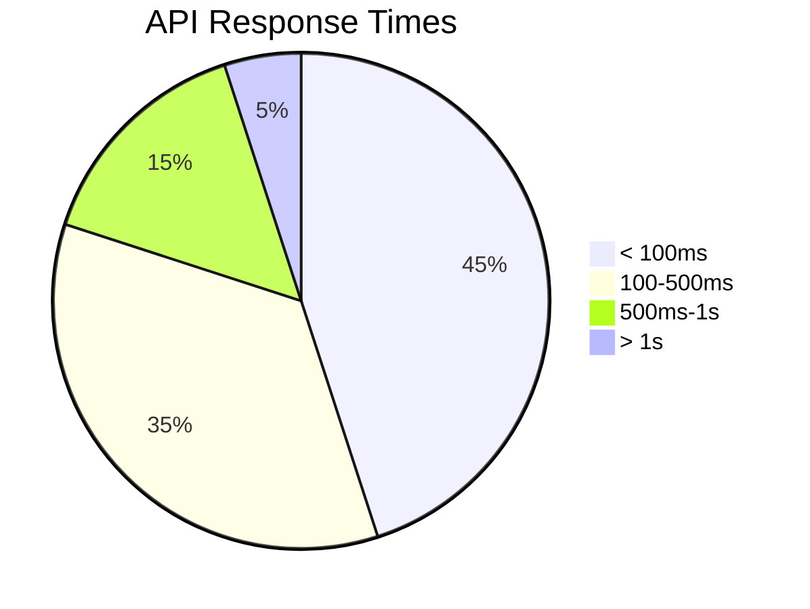
```mermaid
pie title API Response Times
    "< 100ms" : 45
    "100-500ms" : 35
    "500ms-1s" : 15
    "> 1s" : 5
```

## Git Graph

### Branch Strategy

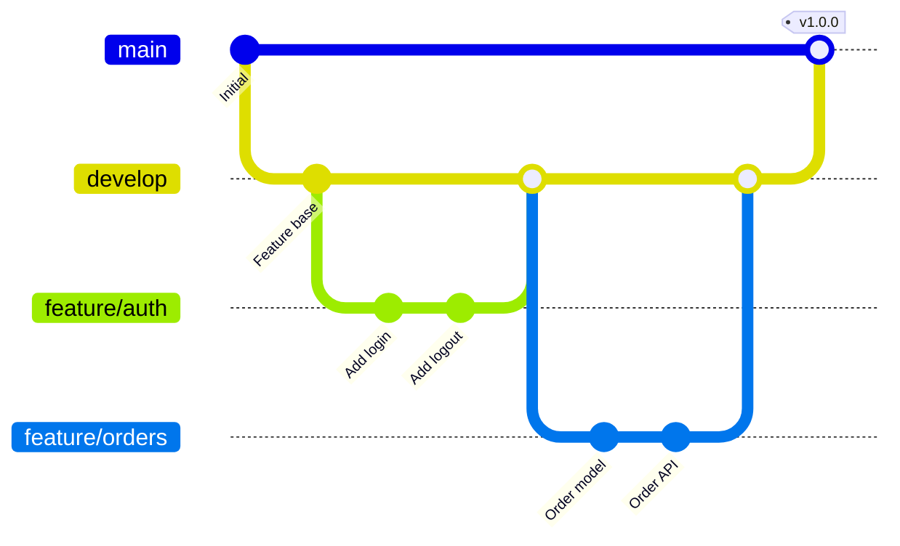
```mermaid
gitGraph
    commit id: "Initial"
    branch develop
    commit id: "Feature base"
    branch feature/auth
    commit id: "Add login"
    commit id: "Add logout"
    checkout develop
    merge feature/auth
    branch feature/orders
    commit id: "Order model"
    commit id: "Order API"
    checkout develop
    merge feature/orders
    checkout main
    merge develop tag: "v1.0.0"
```

## Styling Tips

### Colors and Classes

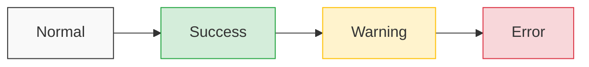
```mermaid
flowchart LR
    A[Normal]:::default --> B[Success]:::success
    B --> C[Warning]:::warning
    C --> D[Error]:::error
    
    classDef default fill:#f9f9f9,stroke:#333
    classDef success fill:#d4edda,stroke:#28a745
    classDef warning fill:#fff3cd,stroke:#ffc107
    classDef error fill:#f8d7da,stroke:#dc3545
```

### Link Styles

```mermaid
flowchart LR
    A --> B
    B -.-> C
    C ==> D
    D --text--> E
    
    %% Solid, dotted, thick, labeled
```

## Best Practices

### Keep Diagrams Simple
- Limit to essential elements
- Use subgraphs to group related items
- Avoid crossing lines where possible

### Use Consistent Naming
- Use same terms as codebase
- Abbreviate consistently
- Include legend if needed

### Make Diagrams Maintainable
- Store in version control
- Update with code changes
- Review in PRs

### Choose Right Diagram Type
- **Flowchart**: Processes, decisions, user flows
- **Sequence**: API calls, message passing
- **ERD**: Data models, relationships
- **State**: Status transitions, lifecycles
- **Architecture**: System components, deployment
