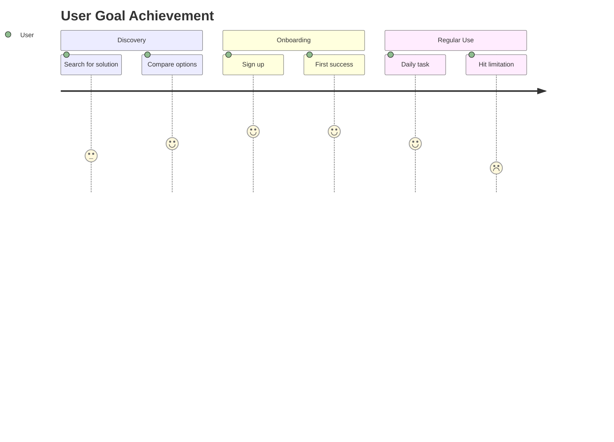
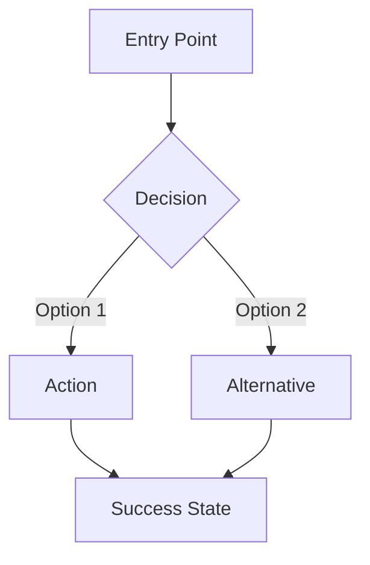

# Persona Creation

Personas bridge research and design. They transform abstract user data into concrete, actionable profiles that inform every product decision.

**This skill extends `ux-design`** — use ux-design for general UX process, this skill for deep persona work.

## Pipeline Overview

```
Research → Synthesis → Personas → Journeys → Validation
    ↓          ↓           ↓          ↓           ↓
  Data     Patterns    Profiles    Maps      Testing
```

### When to Use What

| Situation | Approach | Output |
|-----------|----------|--------|
| Early stage, limited time | Proto-personas | Assumption-based profiles to validate |
| Have research data | Traditional personas | Full demographic + behavioral profiles |
| Focus on motivation | JTBD profiles | Job stories + hiring criteria |
| Need team alignment | Empathy maps | Visual synthesis of user mindset |
| Understanding flow | Journey maps | Step-by-step experience mapping |

## Quick Decision Framework

```
Do you have user research data?
├── No → Create Proto-Personas (validate later)
└── Yes → Do you need demographic detail?
          ├── Yes → Traditional Personas
          └── No → Focus on motivation?
                   ├── Yes → JTBD Profiles
                   └── No → Empathy Maps
```

## Core Principles

### 1. Research-Backed, Not Invented
Personas based on assumptions fail. Even proto-personas should be explicitly marked as hypotheses to validate.

### 2. Actionable, Not Decorative
Every persona element should inform a design decision. If a detail doesn't affect the product, remove it.

### 3. Minimal Viable Set
3-5 personas maximum. More than 5 = unfocused product. If you need more, you're building multiple products.

### 4. Living Documents
Personas evolve with user understanding. Schedule regular reviews and updates.

### 5. Specific Over Generic
- ❌ "Sarah is a busy professional"
- ✅ "Sarah reviews 50+ candidates weekly and needs to make hiring decisions in under 2 minutes per resume"

## Output Formats

All deliverables use **Markdown** for documents and **Mermaid** for diagrams.

### Mermaid Journey Syntax


### Mermaid Flowchart Syntax


## Deliverable Structure

### Persona Document (`persona-[name].md`)
```markdown
# [Persona Name]
> "[Characteristic quote that captures their mindset]"

## Overview
| Attribute | Value |
|-----------|-------|
| Role | ... |
| Context | ... |
| Tech comfort | ... |

## Goals
1. Primary goal
2. Secondary goal

## Frustrations
1. Key pain point
2. Key pain point

## Behaviors
- Relevant pattern
- Relevant pattern

## Jobs to Be Done
- When [situation], I want to [motivation], so I can [outcome]

## Journey Summary
[Link to detailed journey map]
```

### Journey Document (`journey-[name].md`)
```markdown
# [Persona Name]: [Goal] Journey

## Overview
- **Persona**: [Name]
- **Goal**: [What they're trying to achieve]
- **Entry point**: [Where they start]
- **Success state**: [Definition of done]

## Journey Map
[Mermaid diagram]

## Detailed Steps
### Phase 1: [Name]
- **Action**: What they do
- **Thinking**: What they're thinking
- **Feeling**: Emotional state (😊 😐 😤)
- **Pain points**: Frustrations
- **Opportunities**: Where we can help

[Repeat for each phase]

## Key Insights
1. Insight with design implication
2. Insight with design implication
```

---

**References:**
- [references/research-methods.md](references/research-methods.md) — Interview guides, surveys, observation, synthesis techniques
- [references/persona-formats.md](references/persona-formats.md) — Detailed templates for all persona types
- [references/jtbd-framework.md](references/jtbd-framework.md) — Jobs-to-be-Done methodology deep dive
- [references/journey-mapping.md](references/journey-mapping.md) — Journey maps with Mermaid examples
