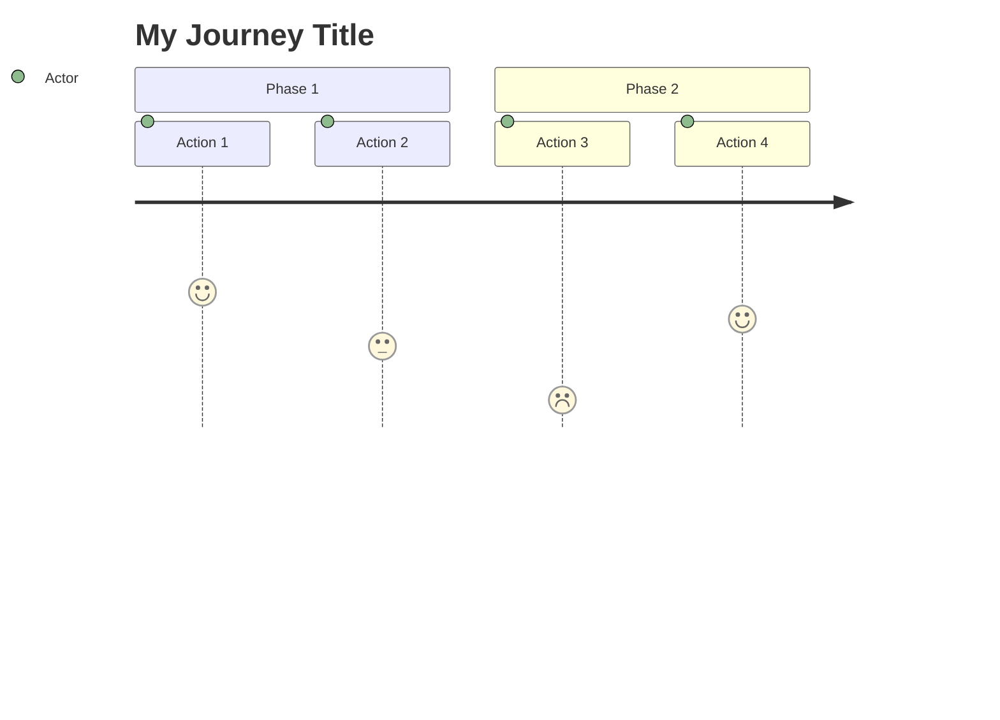
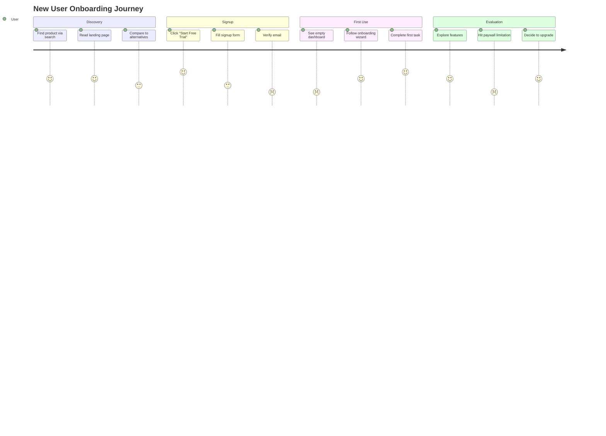
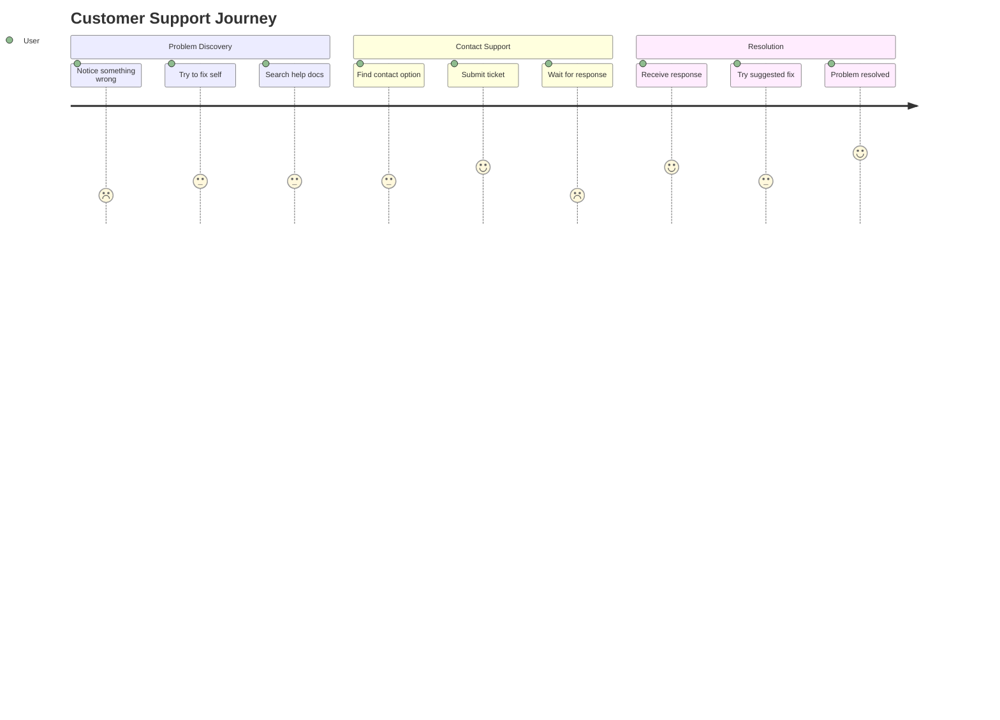
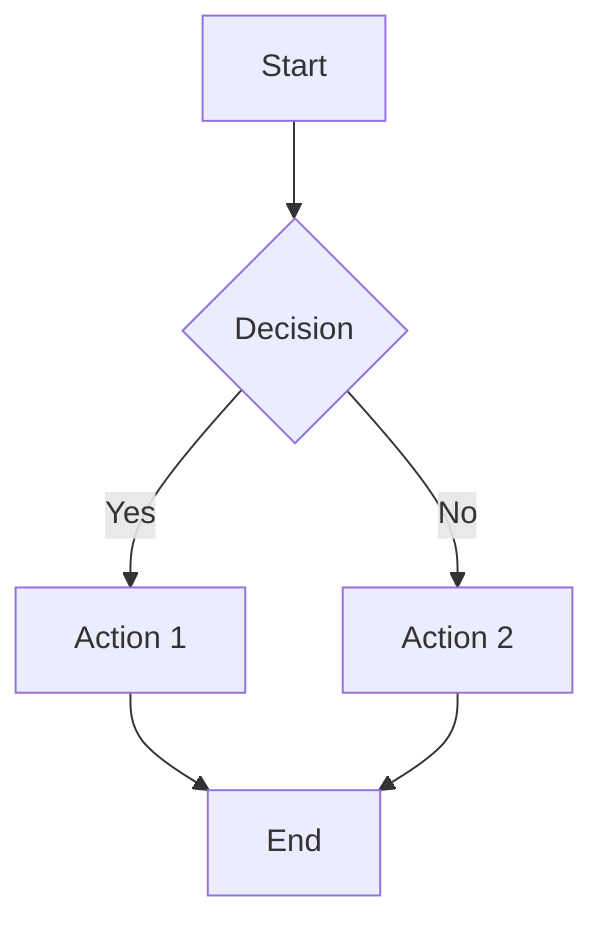
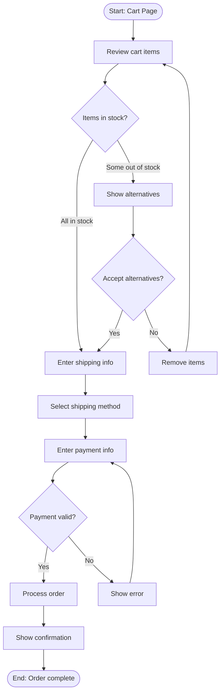
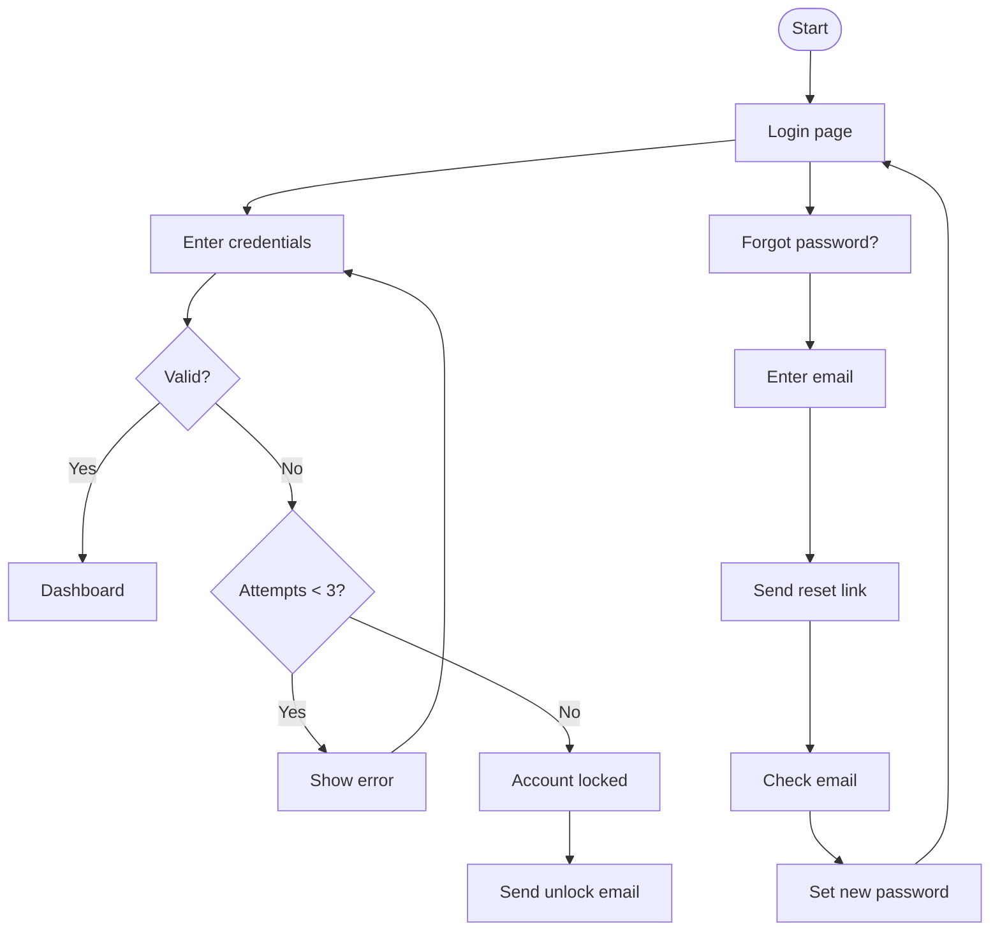
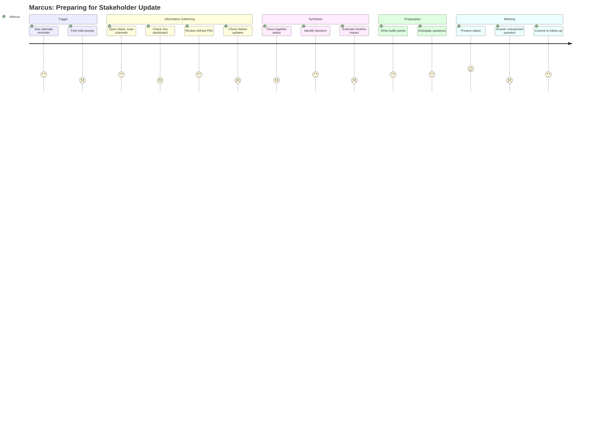

# Journey Mapping

Visualizing the user experience over time, tied to personas.

## Journey Map Fundamentals

A journey map shows how a persona experiences achieving a goal over time, including actions, thoughts, emotions, and opportunities.

### When to Use Journey Maps

- Understanding end-to-end experience
- Identifying pain points across touchpoints
- Aligning team on user perspective
- Finding improvement opportunities
- Communicating user experience to stakeholders

### Journey Map Components

1. **Persona**: Who is on this journey
2. **Scenario**: What goal they're trying to achieve
3. **Phases**: Major stages of the journey
4. **Actions**: What they do at each phase
5. **Thoughts**: What they're thinking
6. **Emotions**: How they feel (the experience curve)
7. **Pain points**: Frustrations and obstacles
8. **Opportunities**: Where we can improve

---

## Mermaid Journey Diagrams

### Basic Journey Syntax



**Score scale**: 1 (frustrated) to 5 (delighted)

### Journey Example: User Onboarding



### Journey Example: Support Request



---

## Mermaid Flowchart Diagrams

For detailed user flows with decision points.

### Basic Flowchart Syntax



**Node shapes:**
- `[Text]` = Rectangle (action/step)
- `{Text}` = Diamond (decision)
- `([Text])` = Stadium (start/end)
- `[(Text)]` = Cylinder (database)
- `((Text))` = Circle (connector)

### User Flow Example: Checkout



### User Flow Example: Login with Recovery



---

## Full Journey Map Template

### Markdown Format

```markdown
# Journey Map: [Persona Name] - [Goal]

## Overview
| Attribute | Value |
|-----------|-------|
| Persona | [Name and brief description] |
| Scenario | [What they're trying to accomplish] |
| Duration | [Typical time span] |
| Entry point | [Where/how journey begins] |
| Success state | [Definition of journey complete] |

## Journey Visualization

[Mermaid journey diagram here]

## Detailed Phases

### Phase 1: [Name]

**Actions:**
- [What they do]
- [What they do]

**Thoughts:**
- "[What they're thinking]"
- "[What they're thinking]"

**Emotions:** 😊 😐 😤 [Select one or describe]

**Touchpoints:**
- [Product/channel they interact with]

**Pain Points:**
- [Frustration]
- [Obstacle]

**Opportunities:**
- [How we could improve this phase]

---

### Phase 2: [Name]
[Same structure]

---

### Phase 3: [Name]
[Same structure]

---

## Key Insights

### Highest Pain Points
1. [Phase X: Pain point with impact]
2. [Phase Y: Pain point with impact]

### Biggest Opportunities
1. [Opportunity with expected impact]
2. [Opportunity with expected impact]

### Moments of Delight
1. [What goes well]
2. [What goes well]

## Recommendations
| Priority | Phase | Recommendation | Expected Impact |
|----------|-------|----------------|-----------------|
| P1 | [Phase] | [Recommendation] | [Impact] |
| P2 | [Phase] | [Recommendation] | [Impact] |

---
**Created:** [Date]
**Based on:** [Research/data source]
**Owner:** [Team/person]
```

---

## Journey Map Example: Complete

```markdown
# Journey Map: Marcus (Engineering Manager) - Get Project Status

## Overview
| Attribute | Value |
|-----------|-------|
| Persona | Marcus, Engineering Manager at Series B startup |
| Scenario | Preparing for weekly stakeholder update meeting |
| Duration | 30 minutes (target: 5 minutes) |
| Entry point | Calendar reminder 30 min before meeting |
| Success state | Has accurate, comprehensive status to share |

## Journey Visualization



## Detailed Phases

### Phase 1: Trigger

**Actions:**
- Sees calendar reminder "Leadership sync in 30 min"
- Closes current work, context switches

**Thoughts:**
- "I should have prepped for this earlier"
- "What have I missed this week?"

**Emotions:** 😐 Mild anxiety, distraction from deep work

**Touchpoints:**
- Calendar (Google Calendar)

**Pain Points:**
- Interrupts flow state
- Recurring meeting prep burden

**Opportunities:**
- Pre-populated status summary
- Earlier, async status collection

---

### Phase 2: Information Gathering

**Actions:**
- Opens Slack, scans #engineering, #project-alpha
- Opens Jira, looks at sprint board and blockers
- Checks GitHub for open PRs and recent merges
- Opens Notion for any async updates

**Thoughts:**
- "Where did Sarah post that update?"
- "Is this Jira data current?"
- "What am I missing?"

**Emotions:** 😤 Frustration, overwhelm

**Touchpoints:**
- Slack
- Jira
- GitHub
- Notion

**Pain Points:**
- Information scattered across 4+ tools
- No single source of truth
- Unclear what's current vs. stale
- Easy to miss important updates

**Opportunities:**
- Unified status dashboard
- Automated status aggregation
- Single notification feed

---

### Phase 3: Synthesis

**Actions:**
- Mentally pieces together overall status
- Identifies which items are blocked
- Estimates if timeline is at risk

**Thoughts:**
- "I think we're on track... mostly"
- "Why didn't I hear about this blocker sooner?"
- "What's the confidence level on this estimate?"

**Emotions:** 😐 Uncertain, working from incomplete picture

**Touchpoints:**
- Mental synthesis (no tool helps here)

**Pain Points:**
- No automated rollup or health indicators
- Discovers surprises during prep, not proactively
- Synthesis is manual and error-prone

**Opportunities:**
- Auto-generated project health summary
- Proactive blocker alerts
- Confidence indicators on estimates

---

### Phase 4: Preparation

**Actions:**
- Writes quick bullet points
- Anticipates likely questions
- Prepares hedging language for uncertain items

**Thoughts:**
- "Hope I don't get blindsided"
- "I should double-check with Sarah before saying this"

**Emotions:** 😐 Cautious, slightly defensive

**Touchpoints:**
- Notes app or doc

**Pain Points:**
- Preparing for questions he can't anticipate
- Uncertainty about accuracy
- No time to verify with team

**Opportunities:**
- Suggested talking points based on data
- Pre-meeting team check-in automation
- Shareable status link for stakeholders

---

### Phase 5: Meeting

**Actions:**
- Presents status update
- Answers expected questions confidently
- Gets unexpected question, improvises
- Commits to follow up on item he didn't know

**Thoughts:**
- "Going okay so far..."
- "I should have known about that"
- "Now I need to chase that down after"

**Emotions:** 😊→😤→😐 Rollercoaster based on questions

**Touchpoints:**
- Video call (Zoom)
- Screen share (sometimes)

**Pain Points:**
- Unexpected questions expose gaps
- Creates follow-up work
- Credibility dips when unsure

**Opportunities:**
- Comprehensive status = fewer surprises
- Easily shareable status for stakeholder pre-read
- Real-time answers to data questions

---

## Key Insights

### Highest Pain Points
1. **Phase 2 (Gathering)**: 20+ minutes across 4 tools just to understand status
2. **Phase 3 (Synthesis)**: Discovers blockers during prep instead of proactively
3. **Phase 5 (Meeting)**: Unexpected questions damage credibility

### Biggest Opportunities
1. Single dashboard with automated status aggregation (eliminate Phase 2)
2. Proactive blocker alerts before they escalate (improve Phase 3)
3. Pre-meeting summary shareable with stakeholders (reduce Phase 5 surprises)

### Moments of Delight
1. When status is clear and meeting goes smoothly
2. When he can confidently answer with data
3. When stakeholders appreciate transparency

## Recommendations
| Priority | Phase | Recommendation | Expected Impact |
|----------|-------|----------------|-----------------|
| P1 | Gathering | Unified status dashboard pulling from Slack/Jira/GitHub | Reduce prep time from 20min to 2min |
| P1 | Synthesis | Auto-generated health summary with blocker alerts | Eliminate surprise discoveries |
| P2 | Meeting | Shareable status link for stakeholder pre-read | Reduce unexpected questions |
| P3 | Trigger | Async status update delivered before meeting | Eliminate recurring prep burden |

---
**Created:** January 2024
**Based on:** 6 manager interviews
**Owner:** Product Team
```

---

## Journey Mapping Workshop

### Workshop Agenda (2 hours)

**1. Setup (10 min)**
- Review persona
- Agree on scenario/goal
- Draw empty journey map on whiteboard/Miro

**2. Individual brainstorm (15 min)**
- Each participant writes sticky notes:
  - Actions (yellow)
  - Thoughts (blue)
  - Pain points (pink)
  - Emotions (green)

**3. Timeline building (30 min)**
- Group stickies into phases
- Sequence actions chronologically
- Add thoughts and emotions to each phase

**4. Pain point prioritization (20 min)**
- Dot vote on biggest pain points
- Discuss top 3-5

**5. Opportunity identification (20 min)**
- Brainstorm solutions for top pain points
- Note opportunities on journey

**6. Wrap-up (15 min)**
- Summarize key insights
- Agree on next steps
- Assign owner for documentation

### Workshop Materials

- Sticky notes (4 colors)
- Markers
- Large whiteboard or digital tool (Miro, FigJam)
- Persona printout
- Timer

---

## Journey Map Types

### Current State Journey
What the experience is today.
- Based on research
- Identifies pain points
- Informs improvement priorities

### Future State Journey
What the experience should be.
- Aspirational design
- Guides product roadmap
- Aligns team on vision

### Day-in-the-Life Journey
Broader context beyond your product.
- Shows where you fit in their life
- Reveals integration opportunities
- Uncovers adjacent jobs

### Service Blueprint
Adds behind-the-scenes view.
- Frontstage: What user sees
- Backstage: What supports the experience
- Useful for operations alignment

---

## Connecting Journeys to Personas

Each persona should have:
1. **Primary journey**: Most common/important goal
2. **Secondary journeys**: Other key scenarios
3. **Edge case journeys**: Less common but important

### Journey Coverage Matrix

```markdown
| Persona | Primary Journey | Secondary Journeys |
|---------|-----------------|-------------------|
| Marcus (Eng Manager) | Get project status | Onboard new team member, Handle escalation |
| Sarah (Founder) | Review team progress | Prepare investor update, Make hiring decision |
| Alex (IC Developer) | Ship a feature | Get unblocked, Review PR |
```

### Linking Journey to Persona Document

In persona document:
```markdown
## Key Journeys

### Primary: Get Project Status
[Brief summary]
→ [Link to full journey map](journey-marcus-status.md)

### Secondary: Onboard New Team Member
[Brief summary]
→ [Link to full journey map](journey-marcus-onboard.md)
```

In journey document:
```markdown
## Overview
| Attribute | Value |
|-----------|-------|
| Persona | [Marcus](persona-marcus.md) |
| ... | ... |
```
